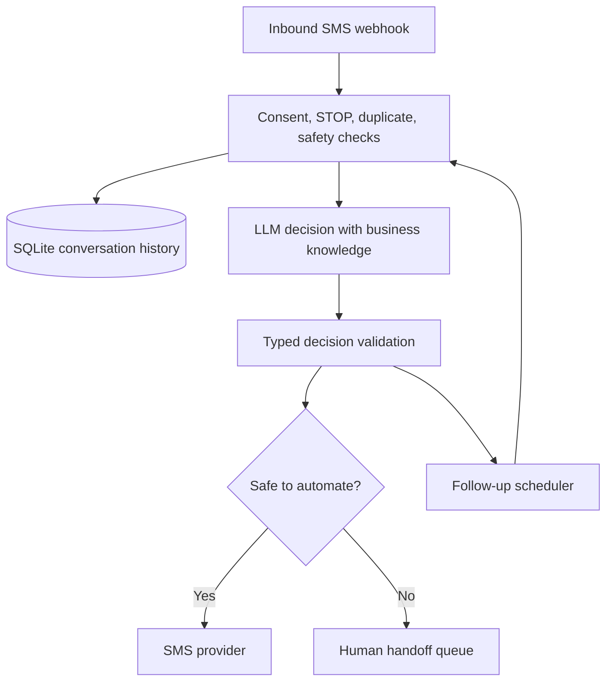

# AI Lead Follow-up — Python reference build

This repository is a credible, runnable example of what a full AI-assisted SMS lead follow-up system could look like. It is meant for a technical conversation and architecture review—not deployment for a real business.

## What the example includes

- FastAPI endpoints for leads, demo messages, and a Twilio-style inbound webhook
- Consent-gated initial outreach, conversation-history API, and human-handoff queue
- SQLite persistence for leads, every inbound/outbound message, follow-ups, consent, stages, and handoffs
- An OpenAI Responses API adapter with typed, structured model output
- A local deterministic demo adapter that works with no API key
- Business facts and FAQs loaded from a replaceable JSON knowledge file
- Lead intent/stage classification and scheduled follow-up decisions
- Provider-event idempotency so webhook retries do not cause duplicate replies
- Deterministic STOP handling, consent checks, emergency keyword handling, and human escalation
- A console SMS adapter and an optional Twilio adapter
- Tests for the highest-risk behavior

## Architecture



The LLM only returns a validated `ReplyDecision`. Application code—not the model—decides whether to send, update state, schedule a follow-up, or escalate.

## Run it locally

```bash
cd lead-followup-demo
python -m venv .venv
source .venv/bin/activate
pip install -e '.[dev]'
cp .env.example .env
uvicorn app.main:app --reload
```

Open `http://localhost:8000/docs`, or simulate a text:

```bash
curl -X POST http://localhost:8000/demo/inbound \
  -H 'Content-Type: application/json' \
  -d '{"phone":"+17025550123","body":"How much is a repair visit?","provider_id":"demo-1"}'
```

Without `OPENAI_API_KEY`, the app uses the intentionally limited `DemoGateway`. With a key, it uses the structured LLM adapter. `SMS_PROVIDER=console` prints texts instead of sending them.

## Conversation decision contract

For every inbound message, the LLM must produce:

```json
{
  "reply": "Short grounded SMS reply",
  "intent": "pricing",
  "confidence": "high",
  "lead_stage": "qualified",
  "needs_human": false,
  "human_reason": null,
  "follow_up_hours": 24
}
```

Pydantic rejects malformed decisions. Unknown business facts must trigger a handoff. If the LLM call fails or returns invalid output, the system records the failure and sends nothing.

## What must be added before real use

This demo deliberately leaves production responsibilities visible instead of pretending that an LLM can “make no mistakes.” A real implementation needs:

1. Verified consent capture, opt-out/help wording, local quiet-hour rules, messaging registration, and legal review.
2. Twilio signature validation, authenticated admin routes, secrets management, rate limits, encryption, audit logs, and redaction/retention rules.
3. PostgreSQL, a durable job queue (Celery/RQ/Arq), retries with idempotency keys, monitoring, dead-letter handling, and deployment configuration.
4. A real CRM/booking integration so the assistant checks live availability and never claims a booking it did not make.
5. A human inbox with assignment and response SLAs.
6. An approved business knowledge workflow, retrieval citations, regression evaluations, adversarial tests, and sampled conversation review.
7. Clear automation disclosure and a fast way to reach a person.

## Suggested build phases

- **Prototype:** this repository, console delivery, synthetic leads, prompt/evaluation iteration.
- **Pilot:** real provider sandbox, PostgreSQL, operator inbox, one approved workflow, limited volume.
- **Production:** CRM/calendar tools, queue workers, monitoring, compliance controls, analytics, and staged rollout.

The core principle is simple: the model drafts and classifies; deterministic code controls permissions and side effects; a person owns ambiguous or risky cases.
